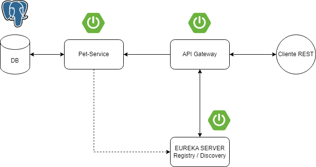

## Microservicios con Spring 🚀

Microservicios con Spring Boot 2, Spring Cloud, Eureka, API RESTful, JPA

## Construido con 🛠️

Las herramientas utilizadas en la construcción del proyecto son:

* [Spring Boot](https://spring.io/projects/spring-boot) - Spring Boot
* [Spring Data JPA](https://spring.io/projects/spring-data-jpa) - Spring Data JPA
* [Spring Cloud](https://spring.io/projects/spring-cloud) - Spring Cloud
* [Microservices with Spring](https://spring.io/blog/2015/07/14/microservices-with-spring) - Microservices with Spring

## Autores(as) ✒️

Grupo 4

- Bravo Flores Gean
- Jara Ulloa Jean
- Vallejos Romero Any
- Quispe Cueva Manuel
- Blas Vera Maria Dariana

## Diagrama

